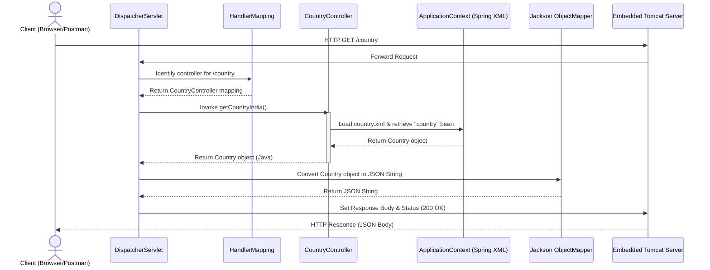

# Theory & Q&A: Country Web Service REST API

This document provides a complete conceptual walkthrough, workflow diagrams, Jackson serialization details, HTTP header breakdowns, troubleshooting steps, and interview preparation questions for the Country Web Service RESTful API.

---

## 📘 Spring REST & Integration Concepts

### 1. REST Architecture & Communication
- **REST (Representational State Transfer)**: An architectural style for distributed systems, using standard HTTP verbs to transfer resource representations.
- **Client-Server Architecture**: Separates the user interface concerns (Client) from the data storage and business logic concerns (Server) to improve portability and scalability.
- **Resource**: Any source of information that can be named and addressed via a URI.
- **URI (Uniform Resource Identifier)**: A unique string of characters used to identify a resource.
- **Stateless Communication**: The server does not store client session state. Each request from the client must contain all necessary authentication and context data.
- **HTTP GET**: The HTTP method used to retrieve a representation of a resource without side-effects on the server.
- **Request**: Sent by the client to request a resource, containing URL, Method, Headers, and optional body.
- **Response**: Returned by the server, containing Status Code, Headers, and the Response body (JSON/Plain Text).
- **JSON (JavaScript Object Notation)**: A lightweight, readable, text-based data format used to transmit structured resource representations.

### 2. `@RestController` & Serialization
- **`@RestController`**: Combines `@Controller` and `@ResponseBody`. Tells Spring that every controller method will serialize its return values directly into the HTTP response body.
- **Jackson Serialization**: Jackson's `ObjectMapper` reads the properties of Java objects (via getters) and automatically converts them into formatted JSON strings. Spring Boot's web starter configures this auto-conversion automatically.

---

## 📐 Request-Response Workflow

Below is the workflow showing what happens internally when a client requests the `/country` endpoint:

---

## 📁 File Configuration Details

### 1. `country.xml` Tags Explained
- `<beans>`: The root container configuration wrapper.
- `<bean id="country" class="...">`: Declares a spring-managed bean, setting its unique lookup ID and class mapping.
- `<property name="code" value="IN"/>`: Inject values into class fields using setter methods (`setCode("IN")`).

### 2. `application.properties`
- `server.port=8083`: Runs Tomcat on port 8083.
- `spring.application.name=spring-learn`: Logical application name.
- `logging.level.com.cognizant=DEBUG`: Exposes DEBUG level logs for our packages.

---

## 🔌 HTTP Headers & Tools

### 1. HTTP Headers Explained

#### Request Headers:
- **Host**: Target server address.
- **Accept**: Acceptable response media types (e.g. `application/json`).
- **User-Agent**: Browser/Client application details.
- **Connection**: Connection persistent control (e.g. `keep-alive`).

#### Response Headers:
- **Content-Type**: Media type of the response body (e.g. `application/json`).
- **Content-Length**: Size of response body in bytes.
- **Date**: Server timestamp of the response generation.

---

### 2. Browser Developer Tools (Network Tab)
- **Request URL**: Full endpoint URL path.
- **Status Code**: HTTP response status (e.g. `200 OK`).
- **Headers**: Lists request and response headers.
- **Response**: The raw body returned by the server (JSON).
- **Timing**: Connection and loading latency diagnostics.

---

### 3. Postman Panels
- **Headers Tab**: Displays sent request headers and returned response headers.
- **Body Tab**: Displays the response payload (formatted in JSON prettifier).
- **Status**: The HTTP response status code.
- **Response Time**: Execution and transmission delay in milliseconds.
- **Response Size**: Size of headers and body payload.

---

## ⚠️ Troubleshooting Common Errors

1. **`NoSuchBeanDefinitionException`**:
   - *Cause*: Requesting the bean `"country"` in the controller, but it is not configured in `country.xml` (or spelling is wrong).
   - *Solution*: Verify bean ID inside `country.xml` matches the lookup name in `CountryController.java`.
2. **`BeanDefinitionStoreException`**:
   - *Cause*: Mismatched or invalid XML tags in `country.xml`.
   - *Solution*: Validate the XML syntax and schema namespaces.
3. **`500 Internal Server Error`**:
   - *Cause*: An exception occurred during execution of the controller method.
   - *Solution*: Inspect console logs to find the root exception stack trace (e.g., classloading or parsing errors).

---

## 🎓 Interview Preparation Q&As

### 30 Beginner Questions
1. What is Spring Boot?
2. What is a RESTful Web Service?
3. What is a resource?
4. What is a URI?
5. What does `@RestController` do?
6. What is the difference between `@Controller` and `@RestController`?
7. What is `@RequestMapping`?
8. Explain the difference between GET and POST requests.
9. What is Jackson?
10. What is serialization?
11. What is deserialization?
12. What is an embedded web server?
13. How do you specify a different port in Spring Boot?
14. What is the default port of Spring Boot?
15. What is the role of `application.properties`?
16. What is the role of `logback.xml`?
17. What is the role of `pom.xml`?
18. What does `mvn clean package` do?
19. What is the Maven phase to compile source code?
20. What is a JavaBean?
21. Why are empty constructors required for JavaBeans?
22. What is the role of `spring-boot-starter-web`?
23. What logging abstraction library is standard in Spring Boot?
24. What does the status code `200 OK` mean?
25. What does the status code `404 Not Found` mean?
26. What does the status code `500 Internal Server Error` mean?
27. Where are resources placed in a Maven project?
28. What is the use of `spring.application.name`?
29. What is Postman?
30. What is curl?

---

### 20 Intermediate Questions
31. How does Jackson convert Java objects to JSON?
32. What is the role of `DispatcherServlet`?
33. Explain the internal workflow when a client hits a REST endpoint.
34. What is the difference between path variables and request parameters?
35. How does Spring component scanning work?
36. What is the difference between `@RequestMapping` and `@GetMapping`?
37. Explain statelessness in REST APIs.
38. What is the purpose of the `Content-Type` header?
39. What is the purpose of the `Accept` header?
40. How does Spring resolve which `HttpMessageConverter` to use?
41. What is the difference between BeanFactory and ApplicationContext?
42. How does DevTools reload classes?
43. What is the Whitelabel Error Page?
44. Why does a Whitelabel Error Page appear when accessing `/`?
45. How does Spring Boot auto-configure Web MVC?
46. What is the purpose of `@ResponseBody`?
47. How do you configure logging levels for specific packages?
48. What is the difference between application.properties and application.yml?
49. What is the purpose of the target folder in Maven?
50. What are transitive dependencies in Maven?

---

### 10 Advanced Questions
51. Explain the internal request lifecycle inside `DispatcherServlet`.
52. How does Spring resolve `HttpMessageConverter` class mappings?
53. What is the performance difference between embedded Tomcat and standalone Tomcat?
54. Explain classloader isolation in DevTools.
55. How does Spring Boot register Tomcat as a servlet container programmatically?
56. Explain the bootstrap sequence of `SpringApplication.run()`.
57. What is the role of `HttpMessageConverter` interface?
58. How do you configure custom response headers programmatically?
59. How does dependency mediation work in Maven POM inheritance?
60. What is the impact of Java 21 virtual threads on embedded Tomcat performance?

---

### 25 Viva Questions & Answers

1. **Q: What is the URL of the country endpoint we created?**
   - *A*: `http://localhost:8083/country`.
2. **Q: What JSON output is returned by the `/country` endpoint?**
   - *A*: `{"code":"IN","name":"India"}`.
3. **Q: What port does this service run on?**
   - *A*: Port 8083.
4. **Q: Which annotation is used on the CountryController class?**
   - *A*: `@RestController`.
5. **Q: What annotation maps the `/country` request?**
   - *A*: `@RequestMapping(value = "/country", method = RequestMethod.GET)`.
6. **Q: What logging library are we using?**
   - *A*: SLF4J with Logback backend.
7. **Q: Where is the `country.xml` configuration loaded from?**
   - *A*: From the classpath (`src/main/resources/country.xml`).
8. **Q: What class is used to load the XML context?**
   - *A*: `ClassPathXmlApplicationContext`.
9. **Q: What does the log `Inside Country Constructor.` indicate?**
   - *A*: That the IoC container has instantiated the Country bean using the default constructor.
10. **Q: What are the log statements in the Country setters?**
    - *A*: `"Setting Country Code."` and `"Setting Country Name."`.
11. **Q: What are the log statements in the Country getters?**
    - *A*: `"Getting Country Code."` and `"Getting Country Name."`.
12. **Q: Why does the controller explicitly call the Country getters?**
    - *A*: To ensure that the getter logs are printed inside the controller method before the END statement logs.
13. **Q: What is the content-type returned by `/country`?**
    - *A*: `application/json`.
14. **Q: What does `logging.level.com.cognizant=DEBUG` do?**
    - *A*: Enables logging debug-level details for classes within the `com.cognizant` package.
15. **Q: What is the default log level if not specified?**
    - *A*: INFO.
16. **Q: What is the purpose of Logback encoders?**
    - *A*: Transforms logging events into formatted strings.
17. **Q: What is Tomcat?**
    - *A*: An open-source web server and servlet container.
18. **Q: What is the benefit of the Maven Wrapper?**
    - *A*: Ensures consistent Maven builds across development systems without local Maven installs.
19. **Q: How do you verify the response headers in Chrome browser?**
    - *A*: Inspect page -> Network tab -> Click the `/country` request -> View Headers panel.
20. **Q: What does `@ResponseBody` do?**
    - *A*: Tells Spring MVC to write the returned object directly to the HTTP response body.
21. **Q: What are the main folders in a standard Maven project?**
    - *A*: `src/main/java` (source code) and `src/main/resources` (configurations).
22. **Q: Why does Spring Boot support hot restart?**
    - *A*: To reduce development restart latency, provided by `spring-boot-devtools`.
23. **Q: What is client-server decoupling in REST?**
    - *A*: The client and server evolve independently; the client only needs to know resource URIs.
24. **Q: What does the `Connection: keep-alive` header do?**
    - *A*: Keeps the TCP connection open for subsequent requests, reducing latency.
25. **Q: What is a Resource?**
    - *A*: Any source of information that can be referenced by a URI.

---

## 🌟 Future Enhancements

To expand this service:
- **Service Layer**: Add `@Service` components to separate business logic from the HTTP controllers.
- **DTOs**: Return custom Java objects representing data Transfer Objects (Jackson will serialize them to JSON automatically).
- **Exception Handling**: Add `@RestControllerAdvice` and `@ExceptionHandler` to return uniform JSON errors for failures.
- **Validation**: Use `jakarta.validation` annotations (like `@NotNull`, `@Size`) to validate request parameters.
- **Database Integration**: Connect to MySQL/H2 using Spring Data JPA.
- **JWT Security**: Add Spring Security and JWT to protect endpoints.
- **API Documentation**: Integrate OpenAPI/Swagger (`springdoc-openapi-starter-webmvc-ui`) to auto-generate documentation.
