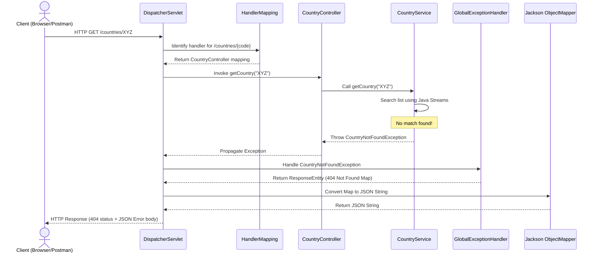

# Theory & Q&A: Get Country Based on Country Code

This document provides a complete conceptual walkthrough, workflow diagrams, Jackson serialization details, HTTP header breakdowns, troubleshooting steps, and interview preparation questions for the Country Retrieval Service RESTful API.

---

## 📘 Spring Web & Layered Architecture Concepts

### 1. REST Architecture & Communication
- **REST (Representational State Transfer)**: Architectural style utilizing standard HTTP methods to exchange state representations of resources.
- **Client-Server Architecture**: Separates the client (UI/requester) from the server (storage and business logic) to improve portability, scalability, and ease of deployment.
- **Resource**: Any entity or object that can be identified and manipulated (e.g. `Country`).
- **URI (Uniform Resource Identifier)**: Address identifying the resource (e.g. `/countries/IN`).
- **Stateless Communication**: The server does not maintain client state or session details. Every request must be fully self-contained.
- **HTTP GET**: Standard safe, idempotent method used to read or query resource representations.
- **Request & Response**: The cycle where the client sends an HTTP request payload, and the server returns an HTTP response containing status codes and payload data.
- **JSON (JavaScript Object Notation)**: Simple text format for data representation.

### 2. Layered Architecture & Dependency Injection
- **Why business logic belongs in the Service Layer**: 
  - Controllers should only act as HTTP traffic managers (handling requests, validating inputs, returning responses).
  - Business rules, searches, mappings, and database queries should be isolated in the Service layer to ensure reusability, testability, and decoupling from the web layer.
- **Constructor Injection vs Field Injection**:
  - Constructor injection is preferred because it guarantees object immutability, facilitates mock-based unit testing, and fails at compile-time if mandatory dependencies are missing.
  - Field injection (using `@Autowired` directly on fields) hides dependencies, makes testing harder, and can result in `NullPointerException`s if context is not fully loaded.
- **Spring Collection Injection**: Used to inject collections like `List`, `Set`, or `Map` using XML tags like `<list>`. This allows injecting a list of beans dynamically at context startup.

---

## 📐 Request-Response Workflow

Below is the workflow sequence diagram detailing the request lifecycle for a country query:

---

## 🔒 Security Best Practice: Restricting Stack Traces
- **Why REST APIs should never expose stack traces**:
  - Exposing stack traces in HTTP responses reveals database structures, library versions, class names, and host information.
  - Malicious users can use this information to find system vulnerabilities (information disclosure vulnerability).
  - APIs should catch exceptions globally and return clean, generalized JSON error payloads instead.

---

## ⚠️ Troubleshooting Common Errors

1. **`404 Not Found` (Mapping Error)**:
   - *Cause*: Typing the wrong URL (e.g. `/country/IN` instead of `/countries/in`) or package scanning omission.
   - *Solution*: Verify controller routing mapping annotations and package configuration.
2. **`NoSuchBeanDefinitionException`**:
   - *Cause*: The `countryList` bean is not registered in the XML configuration, or the `@ImportResource` annotation is missing.
   - *Solution*: Ensure `@ImportResource("classpath:country.xml")` is declared on your application bootstrap class.
3. **`NullPointerException` (Autowire Failure)**:
   - *Cause*: Directly instantiating the service or controller using `new` instead of letting Spring manage bean injection.
   - *Solution*: Avoid `new CountryService()` in code; let Spring inject beans via constructor injection.

---

## 🎓 Interview Preparation Q&As

### 30 Beginner Questions
1. What is a REST API?
2. What is Layered Architecture?
3. What is the role of the Service layer?
4. What is the role of the Controller layer?
5. What does `@Service` denote?
6. What does `@RestController` combine?
7. What does `@PathVariable` do?
8. How does `@GetMapping` work?
9. What is collection injection in Spring?
10. What XML tag represents a list in Spring bean files?
11. What is the default port of Spring Boot?
12. How do you configure a custom port?
13. What is Java Stream?
14. What does the `filter()` method do in Streams?
15. What does `findFirst()` do in Streams?
16. What is the role of `orElseThrow()` in Optional?
17. What is a custom exception?
18. What is the root class of Java exceptions?
19. What is `@ControllerAdvice`?
20. What is `@ExceptionHandler`?
21. What is HTTP status code 404?
22. What does HTTP status code 200 mean?
23. What is stateless communication?
24. What does Jackson do in Spring Boot?
25. Explain the difference between compile and package in Maven.
26. What logging levels are available in Logback?
27. Why do we avoid System.out.println?
28. What is a path parameter?
29. How do you implement case-insensitive string search?
30. Where is `application.properties` placed?

---

### 20 Intermediate Questions
31. Explain why constructor injection is preferred over field injection.
32. What is the difference between `@ControllerAdvice` and `@RestControllerAdvice`?
33. How does Spring Boot auto-configure the Jackson ObjectMapper?
34. Explain the difference between intermediate and terminal operations in Java Streams.
35. How does Spring's `@ImportResource` load XML configuration?
36. Why should we catch exceptions globally rather than using try-catch blocks in every controller?
37. Explain the internal request flow in DispatcherServlet for path variables.
38. What is the difference between `@RequestMapping` and `@GetMapping`?
39. What is the role of AOP in global exception handling?
40. Explain the difference between checked and unchecked exceptions in Java.
41. How does Jackson convert Java object properties to JSON fields?
42. What is the purpose of the `Accept` request header?
43. What is the purpose of the `Content-Type` response header?
44. How do you customize log formats in Logback?
45. What is the role of the Maven Wrapper?
46. What does `additivity` mean in Logback config?
47. How does Spring resolve collection bean dependency conflicts?
48. What is the difference between Singleton and Prototype scopes?
49. What is information disclosure in web security?
50. What is type conversion in Spring MVC?

---

### 10 Advanced Questions
51. Explain the internal mechanism of `@ControllerAdvice` registration in Spring MVC.
52. How does JVM reflection impact field injection vs constructor injection performance?
53. Explain the garbage collection benefits of using Java Streams over traditional loop instantiations.
54. How does `DispatcherServlet` determine HTTP status code mapping from exceptions programmatically?
55. Explain classloader isolation in Spring Boot DevTools.
56. How does Spring Boot register Tomcat programmatically at bootstrap?
57. Explain the three-level caching system in Spring's singleton bean registry.
58. What is the role of `HttpMessageConverter` interface in Jackson serialization?
59. How does dependency mediation work in Maven pom.xml inheritance?
60. What is the impact of Java 21 virtual threads on REST service throughput?

---

### 25 Viva Questions & Answers

1. **Q: What is the URL of the country retrieval endpoint?**
   - *A*: `http://localhost:8083/countries/{code}`.
2. **Q: What JSON output is returned when querying `/countries/in`?**
   - *A*: `{"code":"IN","name":"India"}`.
3. **Q: What JSON output is returned when querying `/countries/xyz`?**
   - *A*: An HTTP 404 error object with details: status 404, error `"Country Not Found"`, and message `"Country code xyz not found"`.
4. **Q: Which annotation registers the global exception handler?**
   - *A*: `@RestControllerAdvice` (or `@ControllerAdvice`).
5. **Q: Which annotation is used on the individual exception handler method?**
   - *A*: `@ExceptionHandler(CountryNotFoundException.class)`.
6. **Q: How does the service class query the country list?**
   - *A*: Using Java Streams: `countryList.stream().filter(...).findFirst().orElseThrow(...)`.
7. **Q: What are the four countries configured in XML?**
   - *A*: India (IN), United States (US), Germany (DE), Japan (JP).
8. **Q: How does the application load `country.xml`?**
   - *A*: Via `@ImportResource("classpath:country.xml")` on `SpringLearnApplication`.
9. **Q: Why is the comparison case-insensitive?**
  - *A*: By using `equalsIgnoreCase()` in the stream filter predicate.
10. **Q: What is the benefit of constructor injection?**
    - *A*: Enforces dependency presence and supports immutability.
11. **Q: What are the three log levels we configured?**
    - *A*: INFO, DEBUG, and ERROR.
12. **Q: What is the logging framework backing SLF4J in this project?**
    - *A*: Logback.
13. **Q: What does the log `Searching Country IN` indicate?**
    - *A*: That the service class has started querying the list for country code `IN`.
14. **Q: What does the log `Country Found` indicate?**
    - *A*: That the stream successfully located the country in the collection.
15. **Q: What does the log `Country Not Found` indicate?**
    - *A*: That no element in the stream matched the country code, throwing `CountryNotFoundException`.
16. **Q: What is the return type of the controller method?**
    - *A*: `Country`.
17. **Q: What is the content-type returned for a successful request?**
    - *A*: `application/json`.
18. **Q: What is Tomcat?**
    - *A*: An open-source web server and servlet container.
19. **Q: What is the benefit of the Maven Wrapper?**
    - *A*: Ensures consistent Maven builds across development systems without local Maven installs.
20. **Q: How do you verify the response headers in Chrome browser?**
    - *A*: Inspect page -> Network tab -> Click the request -> View Headers panel.
21. **Q: What does `@ResponseBody` do?**
    - *A*: Tells Spring MVC to write the returned object directly to the HTTP response body.
22. **Q: What are the main folders in a standard Maven project?**
    - *A*: `src/main/java` (source code) and `src/main/resources` (configurations).
23. **Q: Why does Spring Boot support hot restart?**
    - *A*: To reduce development restart latency, provided by `spring-boot-devtools`.
24. **Q: What is client-server decoupling in REST?**
    - *A*: The client and server evolve independently; the client only needs to know resource URIs.
25. **Q: What is a Resource?**
    - *A*: Any source of information that can be referenced by a URI.

---

## 🌟 Future Enhancements

To expand this service:
- **Database Connectivity**: Replace XML configuration with a database (MySQL, PostgreSQL) using Spring Data JPA.
- **Caching**: Implement Spring Cache (`@Cacheable`) on the service layer to avoid querying the collection/database repeatedly.
- **DTOs**: Map internal models to request/response DTOs to hide internal database IDs.
- **Validation**: Use Jakarta Validation (`@Size`, `@NotBlank`) to restrict path parameters.
- **API Documentation**: Integrate OpenAPI/Swagger (`springdoc-openapi-starter-webmvc-ui`) to auto-generate documentation.
