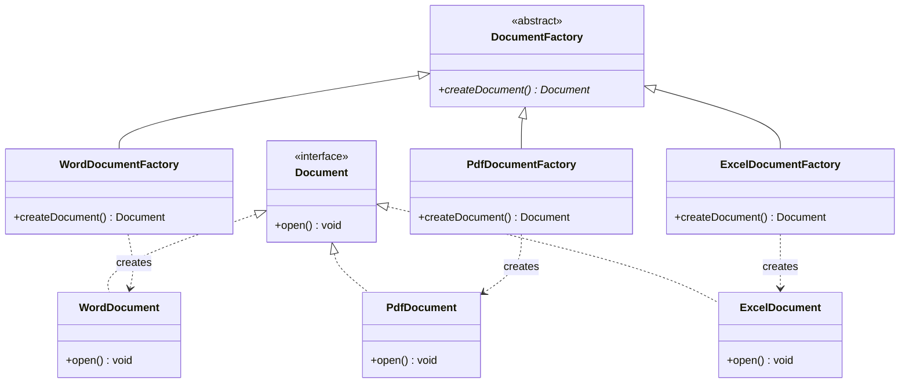

# Theory & Q&A: Factory Method Design Pattern

This document contains detailed theoretical analysis, structural explanations, comparison of interfaces/abstract classes, pattern benefits, troubleshooting steps, and interview preparation questions.

---

## 📘 Factory Method Design Pattern Fundamentals

### 1. What is the Factory Method Design Pattern?
The Factory Method Design Pattern is a creational design pattern that defines an interface or abstract class for creating an object, but allows subclasses to decide which class to instantiate. It lets a class defer instantiation to subclasses.

### 2. Design Mechanics

#### Why Interfaces are used:
- Interfaces define a strict contract for behavior without detailing the implementation.
- It enables **Polymorphism**. The client interacts with the abstract `Document` interface rather than concrete classes (`WordDocument`, `PdfDocument`). This decouples the client from specific product representations.

#### Purpose of the Abstract Factory Class:
- The abstract creator class (`DocumentFactory`) declares the core factory method `createDocument()`.
- It can also contain default business logic that acts upon the product (e.g. creating, opening, logging, or closing a document) independent of its concrete type.

#### How Concrete Factories create different objects:
- Concrete creators extend `DocumentFactory` and override the `createDocument()` method.
- Inside the overridden method, they use the `new` keyword to instantiate and return their specific corresponding product (e.g., `return new WordDocument()`).

### 3. Advantages of the Factory Method Pattern
- **Loose Coupling**: The client code is completely isolated from the instantiation details of concrete products.
- **Single Responsibility Principle (SRP)**: You can move the product creation code into one place in the application, making it easier to maintain.
- **Open/Closed Principle (OCP)**: You can introduce new product types (e.g. `HtmlDocument`) and their corresponding factories without breaking or modifying existing client code.

---

## ⚠️ Troubleshooting Common Errors

1. **Tight Coupling (Direct Instantiation)**:
   - *Cause*: Writing `Document doc = new WordDocument()` directly in the client code, bypassing the factory.
   - *Solution*: Force instantiations through factory classes: `Document doc = wordFactory.createDocument()`.
2. **Class Casting Exception**:
   - *Cause*: Trying to cast a generalized product interface back to a concrete representation incorrectly.
   - *Solution*: Program to the interface (`Document`) rather than casting.

---

## 🎓 Interview Preparation Q&As

### 30 Beginner Questions
1. What is a creational design pattern?
2. Define the Factory Method Design Pattern.
3. What is the difference between Simple Factory and Factory Method?
4. What is an interface in Java?
5. What is an abstract class in Java?
6. Why are abstract factory classes used in this pattern?
7. What method is declared in the Document interface?
8. Name the three concrete Document classes implemented.
9. Name the three concrete Factory classes implemented.
10. What message does `WordDocument.open()` print?
11. What message does `PdfDocument.open()` print?
12. What message does `ExcelDocument.open()` print?
13. What keyword is used by concrete factories to instantiate products?
14. What does polymorphism mean?
15. What is loose coupling?
16. What is tight coupling?
17. What is Core Java?
18. How do you compile a Java file without Maven?
19. How do you run a Java main class from the command line?
20. What is JVM?
21. What is the access modifier of the Document interface methods?
22. Can an interface have constructors?
23. Can an abstract class have constructors?
24. What is the `@Override` annotation used for?
25. Explain the Open/Closed Principle.
26. Explain the Single Responsibility Principle.
27. Where is the source code stored in this project?
28. What is the test class named in this project?
29. What does `Main` or test class run method do?
30. What is GoF?

---

### 20 Intermediate Questions
31. Compare interfaces and abstract classes in Java 8+ (default methods, multiple inheritance).
32. How does Factory Method Pattern defer instantiation to subclasses?
33. Explain the relationship between Creator and Product classes in this pattern.
34. How does the Open/Closed Principle apply when adding a new document type (e.g., Markdown)?
35. Explain how Simple Factory violates the Open/Closed Principle.
36. What is Abstract Factory Pattern? How does it differ from Factory Method?
37. What is dependency inversion?
38. How does the Factory Method pattern support Dependency Inversion?
39. Can a factory method take parameters to decide which product to create?
40. Explain the pros and cons of parameterized factory methods.
41. What is lazy initialization in factories?
42. How do you test factory classes using Mockito?
43. What is a class loader?
44. How does reflection allow dynamic class instantiation in factories?
45. What is `Class.forName()` used for?
46. Can a concrete factory return a Singleton product?
47. How does Java's `Calendar.getInstance()` implement a factory-like behavior?
48. What is the cost of object instantiation in Java?
49. What is garbage collection?
50. What is the stack memory lifecycle of factory objects?

---

### 10 Advanced Questions
51. Analyze the performance difference between dynamic reflection-based factories and static class-binding factories.
52. How does the dependency injection pattern in Spring framework replace GoF Factory Method pattern?
53. Explain the Factory pattern implementation inside JDBC's `DriverManager.getConnection()`.
54. Design a dynamic factory registry using Java Reflection and Annotations.
55. Explain the difference between compile-time dependency and runtime dependency in this project.
56. How does Java's `ServiceLoader` implement the factory method concept at modular boundaries?
57. What is the impact of Java 21 record classes on data-centric product hierarchies in factories?
58. Explain how the Factory Method Pattern can be integrated with the Prototype Pattern for cloning prototypes.
59. How does dependency mediation work in Maven when pulling factories from external JARs?
60. Explain virtual threads (Java 21) handling factory instantiations across memory limits.

---

### 25 Viva Questions & Answers

1. **Q: What is the folder name of this project?**
   - *A*: `Factory(design)`.
2. **Q: What interface represents the Product?**
   - *A*: `Document` (package `com.cognizant.factory`).
3. **Q: What is the abstract Creator class named?**
   - *A*: `DocumentFactory`.
4. **Q: What are the three concrete document types created?**
   - *A*: `WordDocument`, `PdfDocument`, and `ExcelDocument`.
5. **Q: What does the factory method `createDocument()` return?**
   - *A*: An object of type `Document`.
6. **Q: What method is implemented by the `Document` interface?**
   - *A*: `void open()`.
7. **Q: What message is printed when `ExcelDocument.open()` is called?**
   - *A*: `"Excel Document is opened."`.
8. **Q: What are the three factory subclasses?**
   - *A*: `WordDocumentFactory`, `PdfDocumentFactory`, and `ExcelDocumentFactory`.
9. **Q: How does the client class create a PDF document?**
   - *A*: By instantiating `PdfDocumentFactory` and calling `createDocument()`.
10. **Q: Why do we write `Document pdfDoc = pdfFactory.createDocument()` instead of using concrete types?**
    - *A*: To code to interfaces (`Document`) rather than concrete implementations, ensuring loose coupling.
11. **Q: Can we add a new document type without modifying `DocumentFactory`?**
    - *A*: Yes, by implementing `Document` and extending `DocumentFactory` with a new concrete factory.
12. **Q: What are four real-world uses of the Factory Method Pattern?**
    - *A*: Document Management Systems, Notification Services, Database Drivers, Payment Gateways.
13. **Q: Why is there no `pom.xml` configured with Maven dependencies?**
    - *A*: Because this is a Core Java project that runs without external libraries or build managers.
14. **Q: Where is the source code stored?**
    - *A*: Inside the directory `src/com/cognizant/factory/`.
15. **Q: What is the compiler command to build this project?**
    - *A*: `javac -d bin src/com/cognizant/factory/*.java`.
16. **Q: What is the command to run the test class?**
    - *A*: `java -cp bin com.cognizant.factory.FactoryMethodTest`.
17. **Q: What is the space complexity of this pattern?**
    - *A*: $O(1)$ constant auxiliary space.
18. **Q: How does JVM resolve polymorphism at runtime?**
    - *A*: Using virtual method lookup tables (vtable) to invoke the correct subclass method.
19. **Q: What is the role of `WordDocumentFactory`?**
    - *A*: To instantiate and return a `WordDocument` object.
20. **Q: What does the test runner print?**
    - *A*: Word, PDF, and Excel document opening messages separated by empty lines.
21. **Q: Can an abstract factory have non-abstract methods?**
    - *A*: Yes, it can contain helper methods that perform operations on the created Document objects.
22. **Q: What is the disadvantage of the Factory Method Pattern?**
    - *A*: It requires creating a new factory subclass for every new product subclass, which can inflate the class hierarchy.
23. **Q: What is GoF?**
    - *A*: The Gang of Four design pattern specification.
24. **Q: How does this pattern support the Open/Closed Principle?**
    - *A*: Existing classes remain closed to modification; new document types are added by creating new classes.
25. **Q: Is there any static factory method in our code?**
    - *A*: No, we implemented the classic polymorphic factory method where concrete subclasses handle instantiation.

---

## 🌟 Future Enhancements

To extend this pattern:
- **Parameterized Factory Method**: Pass a parameter (like file extension or mime-type) to a single factory class to resolve dynamic creation mappings.
- **Reflection Registry**: Map product classes in a configuration properties file and load them dynamically using reflection to eliminate factory subclasses entirely.
